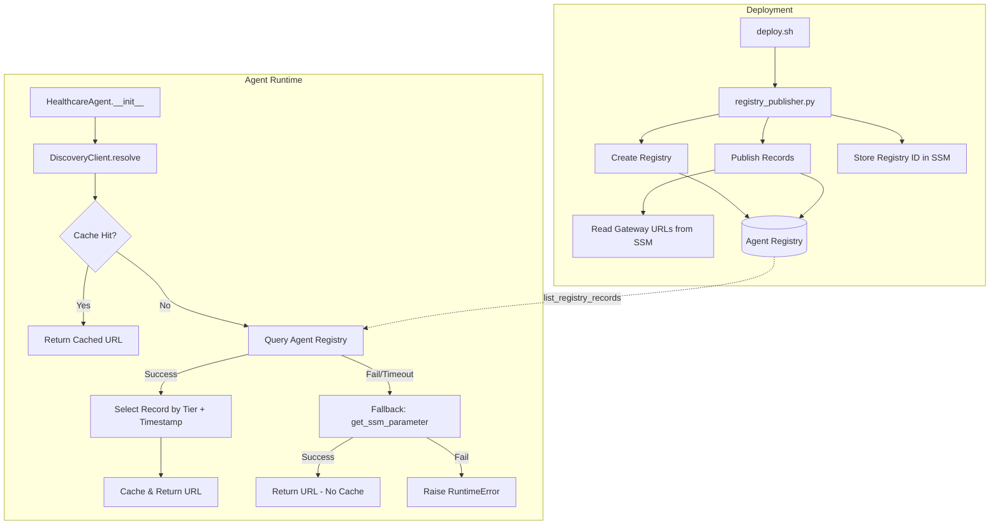
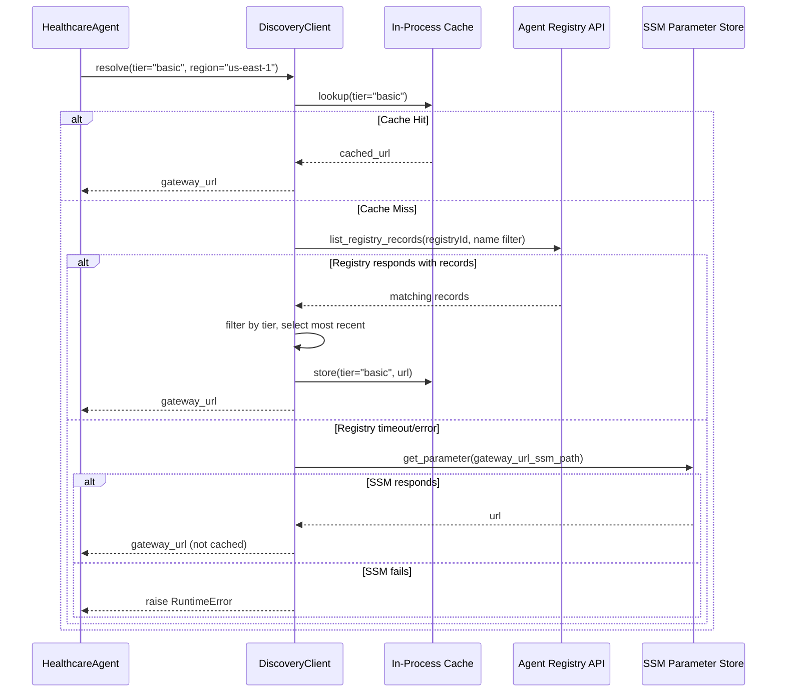

# Design Document: Agent Registry Integration

## Overview

This design describes how the multi-tenant healthcare agent discovers MCP gateway endpoints from the AWS Agent Registry instead of relying solely on SSM Parameter Store. The system introduces a `DiscoveryClient` module that queries the Agent Registry at agent initialization, selects the correct record by tier, and falls back to SSM parameters when the registry is unavailable. A companion `RegistryPublisher` script creates the registry and publishes gateway records during deployment.

The design keeps the change surface minimal: the `HealthcareAgent.__init__` method replaces its direct `get_ssm_parameter` call for the gateway URL with a single `DiscoveryClient.resolve()` call. Everything downstream (MCPClient initialization, bearer token forwarding, tenant headers) remains unchanged.

Key design decisions:
- **Registry as primary, SSM as fallback**: The Agent Registry provides centralized, dynamic endpoint management. SSM parameters remain as a reliable fallback so the agent stays operational during registry outages.
- **Process-lifetime caching for registry results only**: Successful registry lookups are cached in-process to avoid redundant API calls. Fallback results are never cached so the system automatically retries the registry on subsequent requests.
- **IAM authentication via boto3 SigV4**: No additional credentials or secrets are needed — the existing execution role is used for all registry API calls.
- **Deployment-time publishing**: The registry is populated before agents start, so discovery works from the first request.

## Architecture



### Component Interaction Sequence



## Components and Interfaces

### 1. DiscoveryClient (`agent/discovery_client.py`)

A standalone module importable independently for testing.

```python
class DiscoveryClient:
    """Resolves MCP gateway URLs from the Agent Registry with SSM fallback."""

    _cache: dict[str, str]  # tier -> url (class-level, process-lifetime)

    def __init__(self, region: str | None = None):
        """
        Args:
            region: AWS region. Defaults to AWS_REGION env var or "us-east-1".
        """

    def resolve(self, tier: str) -> str:
        """
        Resolve the MCP gateway URL for the given tier.

        Args:
            tier: One of the tiers defined in TIER_CONFIG ("basic" or "premium").

        Returns:
            A fully-qualified HTTPS URL string.

        Raises:
            RuntimeError: If both registry and SSM lookups fail.
        """

    @classmethod
    def clear_cache(cls) -> None:
        """Clear all cached registry results across all tiers."""
```

**Design rationale**: The cache is a class-level dictionary so it persists across multiple `DiscoveryClient` instances within the same process. This satisfies Requirement 7 (process-lifetime caching) while allowing `clear_cache()` for testability.

### 2. RegistryPublisher (`scripts/registry_publisher.py`)

A CLI script invoked by `deploy.sh` after gateways are created.

```python
def create_or_get_registry(client, registry_name: str) -> str:
    """
    Create the Agent Registry if it doesn't exist, wait for READY state.

    Returns:
        The registry ID.

    Raises:
        SystemExit: If creation fails or registry doesn't reach READY in 120s.
    """

def publish_record(client, registry_id: str, tier: str, gateway_url: str) -> None:
    """
    Publish or update a registry record for the given tier.

    Raises:
        SystemExit: If record publishing fails.
    """

def main():
    """CLI entrypoint: create registry and publish both tier records."""
```

### 3. Modified `HealthcareAgent.__init__` (in `agent/agent.py`)

The only change in the existing agent code:

```python
# Before:
gateway_url = get_ssm_parameter(config["gateway_url_ssm"])

# After:
from .discovery_client import DiscoveryClient
discovery = DiscoveryClient()
gateway_url = discovery.resolve(tier)
```

### 4. Updated `deploy.sh`

Adds a single step after gateway creation and before agent configuration:

```bash
print_step "Publishing MCP gateway records to Agent Registry..."
python scripts/registry_publisher.py
```

## Data Models

### Registry Record Schema

Each registry record is created using the `MCP` descriptor type with a custom metadata structure in the MCP server descriptor:

```json
{
  "name": "healthcare-mcp-gateway-{tier}",
  "description": "Healthcare Lambda Gateway - {Tier} Tier",
  "descriptorType": "MCP",
  "descriptors": {
    "mcp": {
      "server": {
        "inlineContent": "{\"tier\": \"{tier}\", \"endpoint_url\": \"https://...\", \"updated_at\": \"2025-01-15T10:30:00Z\"}"
      }
    }
  }
}
```

**Parsed inline content fields:**

| Field | Type | Description | Constraints |
|-------|------|-------------|-------------|
| `tier` | string | Service tier identifier | `"basic"` or `"premium"` |
| `endpoint_url` | string | MCP gateway HTTPS URL | ≤ 2048 chars, starts with `https://` |
| `updated_at` | string | Last update timestamp | ISO 8601 UTC format |

### DiscoveryClient Cache Structure

```python
# Class-level dict: tier -> gateway_url
_cache: dict[str, str] = {}
# Example: {"basic": "https://gw-abc123.bedrock-agentcore.us-east-1.amazonaws.com/mcp", ...}
```

### SSM Parameters (new)

| Path | Type | Description |
|------|------|-------------|
| `/app/healthcare/agentcore/registry_id` | String | Agent Registry resource ID |

### TIER_CONFIG Extension

The existing `TIER_CONFIG` in `agent/agent.py` already contains `gateway_url_ssm` paths. These are used by the `DiscoveryClient` as fallback sources — no changes to `TIER_CONFIG` are required.

## Correctness Properties

*A property is a characteristic or behavior that should hold true across all valid executions of a system — essentially, a formal statement about what the system should do. Properties serve as the bridge between human-readable specifications and machine-verifiable correctness guarantees.*

### Property 1: Record selection picks most recent matching record

*For any* non-empty list of registry records where at least one matches the requested tier, the `DiscoveryClient` SHALL return the `endpoint_url` from the record with the most recent `updated_at` timestamp among tier-matching records. If two or more matching records share the same most recent timestamp, the first one in the list SHALL be selected.

**Validates: Requirements 1.2, 1.3**

### Property 2: Invalid records are skipped during selection

*For any* set of registry records where some are missing the `tier` field, the `endpoint_url` field, or the `updated_at` timestamp field, the `DiscoveryClient` SHALL exclude those records from consideration and select only from records that have all three required fields with valid values (tier is "basic" or "premium", endpoint_url starts with "https://" and is ≤ 2048 characters, updated_at is valid ISO 8601 UTC).

**Validates: Requirements 4.1, 4.2, 4.4, 4.5**

### Property 3: Dual-failure error message includes all diagnostic information

*For any* tier name string, registry failure reason string, and SSM failure reason string, when both the Agent Registry and SSM lookups fail, the raised `RuntimeError` message SHALL contain the tier name, the registry failure reason, and the SSM failure reason.

**Validates: Requirements 2.2**

### Property 4: Fallback warning log includes tier, reason, and path

*For any* tier name string, registry failure reason string, and SSM parameter path string, when the `DiscoveryClient` falls back to SSM, the warning log message SHALL contain the tier name, the registry failure reason, and the SSM parameter path.

**Validates: Requirements 2.3**

### Property 5: Successful registry resolution is cached and reused

*For any* tier and gateway URL successfully resolved from the Agent Registry, a subsequent `resolve()` call for the same tier SHALL return the same URL without making any Agent Registry API call.

**Validates: Requirements 7.1, 7.2**

### Property 6: Fallback results are never cached

*For any* tier whose gateway URL was resolved via the SSM fallback (because the registry was unavailable), the `DiscoveryClient` cache SHALL NOT contain an entry for that tier, and a subsequent `resolve()` call SHALL re-attempt the Agent Registry lookup.

**Validates: Requirements 7.3, 7.4, 7.5**

## Error Handling

### DiscoveryClient Errors

| Scenario | Behavior | Outcome |
|----------|----------|---------|
| Registry timeout (>5s) | Catch `ReadTimeoutError`/`ConnectTimeoutError` | Log warning, fall back to SSM |
| Registry HTTP error | Catch `ClientError` | Log warning, fall back to SSM |
| IAM AccessDenied | Catch `ClientError` with code `AccessDeniedException` | Log error with role ARN, fall back to SSM |
| Credential failure | Catch `NoCredentialsError`/`CredentialRetrievalError` | Log error, fall back to SSM |
| SSM failure (after registry failure) | Catch exception from `get_ssm_parameter` | Raise `RuntimeError` with both failure reasons |
| Invalid record (missing fields) | Validation check | Skip record, log warning with record ID and missing field |
| No matching records for tier | Empty filtered list | Fall back to SSM |
| Invalid tier parameter | Not in TIER_CONFIG | Raise `ValueError` immediately (no API calls) |

### RegistryPublisher Errors

| Scenario | Behavior | Outcome |
|----------|----------|---------|
| Registry creation fails | `create_registry` raises exception | Log error, exit non-zero |
| Registry not READY within 120s | Polling loop timeout | Log error, exit non-zero |
| Registry already exists | `ConflictException` from `create_registry` | List registries, find existing ID, continue |
| Record publish fails | `create_registry_record` raises exception | Log error with tier name, exit non-zero |
| Record already exists | `ConflictException` from `create_registry_record` | Update existing record via `update_registry_record` |
| SSM read fails (gateway URL) | `get_ssm_parameter` raises exception | Log error, exit non-zero |

### Timeout Budget

The `DiscoveryClient` must resolve within the 30-second initialization window of AgentCore Runtime:
- Registry query: max 5 seconds (boto3 `read_timeout` + `connect_timeout`)
- SSM fallback: typically < 1 second (regional call, existing pattern)
- Total worst-case: ~6 seconds, well within 30-second budget

## Testing Strategy

### Property-Based Tests (using `hypothesis` for Python)

Each correctness property maps to a single property-based test with minimum 100 iterations:

| Property | Test Approach | Generator Strategy |
|----------|---------------|-------------------|
| P1: Record selection | Generate lists of `RegistryRecord` objects with random tiers and timestamps | `st.lists(st.builds(RegistryRecord, tier=st.sampled_from(["basic","premium","other"]), updated_at=st.datetimes(), endpoint_url=valid_urls()))` |
| P2: Invalid record skipping | Generate records with random field omissions | `st.lists(st.builds(PartialRecord, tier=st.one_of(st.none(), st.text()), ...))` |
| P3: Error message completeness | Generate random tier, reason1, reason2 strings | `st.text(min_size=1, max_size=50)` for each field |
| P4: Fallback log completeness | Generate random tier, reason, path strings | Same as P3 |
| P5: Cache hit | Generate random tier/URL, mock registry, call resolve twice | `st.sampled_from(["basic","premium"])`, `st.from_regex(r'https://[a-z]+\.example\.com')` |
| P6: Fallback not cached | Generate random tier, mock registry to fail then succeed | Same generators as P5 |

**Configuration:**
- Library: `hypothesis` (already available in Python ecosystem, compatible with `pytest`)
- Minimum iterations: 100 per property (via `@settings(max_examples=100)`)
- Tag format: `# Feature: agent-registry-integration, Property {N}: {title}`

### Unit Tests (example-based)

- `DiscoveryClient` with mocked boto3 clients:
  - Registry returns exactly one matching record → returns that URL
  - Registry returns no records → falls back to SSM
  - Registry raises AccessDenied → logs role ARN, falls back to SSM
  - Registry raises timeout → falls back to SSM
  - Both fail → raises RuntimeError
  - Invalid tier → raises ValueError
- `RegistryPublisher` with mocked boto3 clients:
  - Happy path: creates registry, publishes 2 records, stores SSM param
  - Registry exists (ConflictException) → skips creation
  - Record exists (ConflictException) → updates record
  - Registry creation timeout → exits non-zero

### Integration Tests

- End-to-end deployment test (if registry is available in test account):
  - Run `registry_publisher.py` against real Agent Registry
  - Verify records are queryable via `list_registry_records`
  - Run `DiscoveryClient.resolve()` and verify correct URL returned
- Verify `HealthcareAgent` initialization succeeds with registry available
- Verify `HealthcareAgent` initialization succeeds with registry unavailable (SSM fallback)

