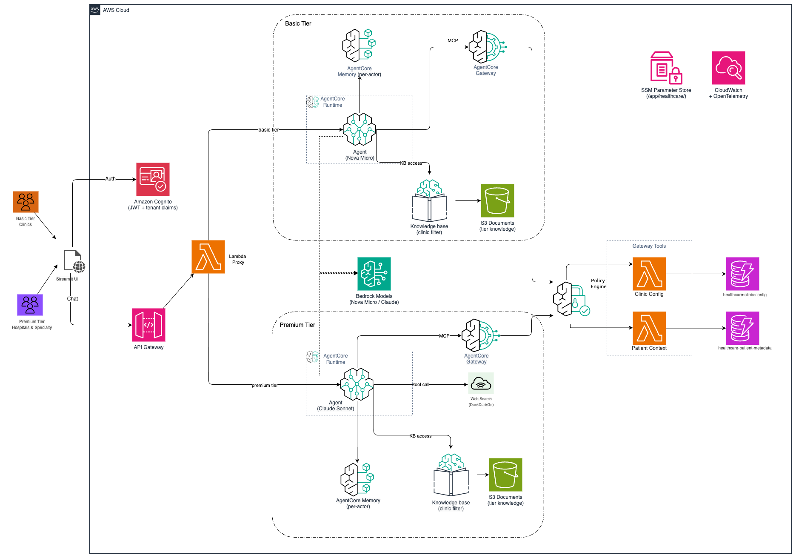

# Multi-Tenant Healthcare Agent with Amazon Bedrock AgentCore

> **⚠️ Disclaimer:** This is sample code for demonstration and educational purposes only. It is not intended for production use. Use at your own risk.

A multi-tenant AI clinical document assistant built on Amazon Bedrock AgentCore, demonstrating common multi-tenancy concerns when building agentic SaaS applications.

## What It Does

Healthcare staff can search, summarize, and analyze patient records and clinical documents. Each clinic is fully isolated — they can only see their own data.

## Quick Start

### Prerequisites

- AWS account with Bedrock access enabled
- AWS CLI configured with appropriate permissions
- Python 3.12+

### Deploy

```bash
git clone <repository-url>
cd agentcore-multitenancy

python3 -m venv .venv
source .venv/bin/activate
pip install -r requirements.txt

chmod +x deploy.sh
./deploy.sh
```

### Run the Web UI

```bash
source .venv/bin/activate
streamlit run app.py --server.port 8501
```

Log in with test credentials from `credentials/test_users.json` (generated during deployment).

### Example Chat Queries

Once logged in, try these prompts to explore the agent's capabilities:

| Prompt | What It Does | Tier |
|--------|-------------|------|
| "List out all patient info" | Retrieves patient metadata for your clinic from DynamoDB | Both |
| "Show me all available documents" | Searches the Knowledge Base for all clinical documents scoped to your clinic | Both |
| "What are the current medications patient A is taking?" | Searches current medications | Both |
| "Get me the latest COVID-19 guidance from CDC" | Uses web search to fetch current CDC guidelines | Premium only |
| "What are the current treatment protocols for Type 2 diabetes?" | Searches medical literature via web grounding | Premium only |

> **Note:** Basic tier users only have access to document search and patient context tools. Web search requires a Premium tier account.

## Cleanup

```bash
chmod +x scripts/cleanup.sh
./scripts/cleanup.sh
```

## Multi-Tenancy Patterns Demonstrated




### 1. Data Isolation — Knowledge Base Metadata Filtering
Each clinic's documents are tagged with a `clinic_id` metadata field. At query time, the agent's `retrieve_clinic_documents` tool applies a metadata filter so tenants only retrieve their own documents.

```python
# agent/tools/retrieve_clinic_documents.py
response = client.retrieve(
    knowledgeBaseId=kb_id,
    retrievalQuery={"text": query},
    retrievalConfiguration={
        "vectorSearchConfiguration": {
            "filter": {"equals": {"key": "clinic_id", "value": clinic_id}}
        }
    },
)
```

### 2. Memory Isolation — Hierarchical actor_id
Conversation history is scoped per-tenant using a hierarchical `actor_id`:

```
actor_id = "{tier}-{clinic_id}-{user_id}"
# e.g., "premium-hospital-a-04684408-00d1-7087-e9c6-e033aff7f0ee"
```

Memory namespaces ensure complete isolation:
```
clinic/{actorId}/facts/{sessionId}
clinic/{actorId}/preferences
```

### 3. Tier-Based Routing — Single Agent, Config-Driven
One `HealthcareAgent` class serves both tiers. Differences are driven by a `TIER_CONFIG` dict:

| Concern | Basic | Premium |
|---------|-------|---------|
| Model | Mistral Ministral 8B | GPT-OSS 120B |
| Tools | Document search, patient context | + Web search |
| Guardrails | Tier-specific (ApplyGuardrail API) | Tier-specific (ApplyGuardrail API) |
| Access Policy | Business hours (8am–6pm) | 24/7 |

### 4. Authentication & Tenant Identity — Cognito JWT
Amazon Cognito issues JWTs with custom attributes (`custom:tier`, `custom:clinic_id`). The API Gateway Lambda extracts these claims and forwards them to the agent as payload fields.

### 5. Cost Attribution — Bedrock Projects + Structured Usage Logging
Per-tenant cost tracking via:
- **Bedrock Projects**: Each tier has a dedicated project whose tags flow into AWS Cost Explorer. The agent connects to the inference endpoint and passes the project ID on every inference request.
- **Structured usage logs**: After each invocation, the agent emits a JSON log with `clinic_id`, `tier`, `model_id`, and token counts. These logs can be queried via CloudWatch Logs Insights for per-clinic cost attribution.

### 6. Gateway Header Propagation
Tenant context flows through AgentCore Gateway via headers:
```
X-Tier: premium
X-Clinic-ID: hospital-a
X-S3-Prefix: premium-tier/hospital-a/
```

## Project Structure

```
├── main.py                        # Unified AgentCore entrypoint (AGENT_TIER env var)
├── app.py                         # Streamlit web UI
├── agent/                         # Agent code (single module, both tiers)
│   ├── agent.py                   # HealthcareAgent — tier-configurable via TIER_CONFIG
│   ├── agent_task.py              # Async task runner
│   ├── context.py                 # TenantContext — ContextVar-based tenant state
│   ├── memory_hook.py             # Strands MemoryHook for AgentCore Memory
│   └── tools/
│       └── retrieve_clinic_documents.py  # KB retrieval with clinic filtering
├── app_modules/                   # Streamlit UI
│   ├── auth.py                    # Cognito OAuth2 PKCE flow
│   └── chat.py                    # ChatManager (API Gateway path)
├── scripts/                       # Deployment scripts
├── prerequisite/                  # CloudFormation templates, Lambda code, sample docs
│   └── lambda/python/             # Lambda function code
├── test/                          # Test suite
└── config/                        # Deployment configuration templates
```

## License

This project is licensed under the MIT License — see the [LICENSE](LICENSE) file for details.


